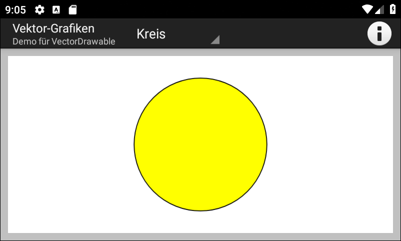
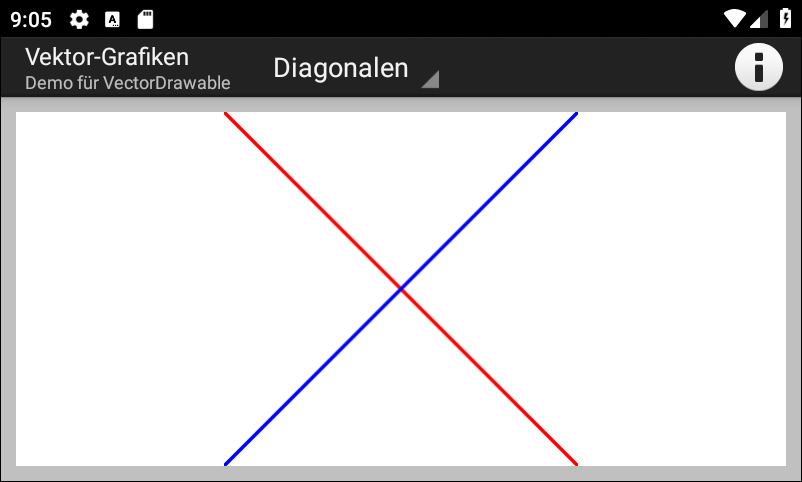
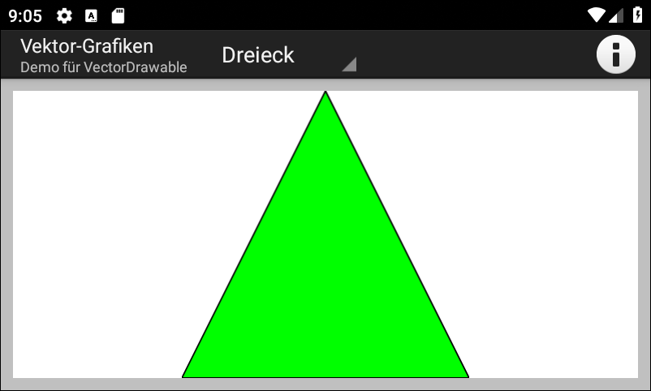

# Android-App "Vektor-Grafiken" #

 

App demonstrates usage of **Vector Graphics** in Android. *Vector Graphics* are composed of geometrics 
shapes (e.g., circles, lines, rectangles) and therefore they can be rendered at any size without loss 
of quality.

 

Identifiers (names for classes, variables and methods), (JavaDoc) comments and UI texts are in German only.

 

----

## Screenshots ##

 

  

 

----

## License ##

 

See the [LICENSE file](LICENSE.md) for license rights and limitations (BSD 3-Clause License).

 